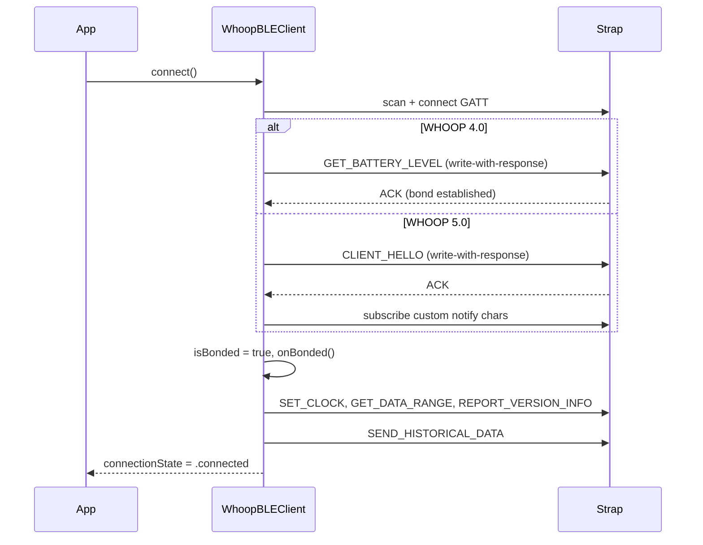

# WHOOP bonded integration guide (agent playbook)

This is a **future implementation guide** for agents working in the Aceso repo. Follow it when a bonded WHOOP strap is available for live testing and you need to wire SDK callbacks into the app and server.

Prerequisites: read [whoop-bonded-requirements.md](./whoop-bonded-requirements.md) and [whoop-open-source-reference.md](./whoop-open-source-reference.md).

---

## Current state (as of SDK 1.0.0)

| Area | Status |
|---|---|
| `WhoopBLEClient` bond + handshake | ✅ Implemented — auto `SET_CLOCK`, history offload, version/range |
| `isBonded` property | ✅ Public |
| Haptics / alarms API | ✅ Public methods on `WhoopBLEClient` |
| `onSamples` / `onHistoricalFrame` callbacks | ✅ Defined on client |
| Aceso `onSamples` → server upload | ❌ **Not wired** — `aceso-app.swift` creates client but sets no callbacks |
| Aceso historical frame persistence | ❌ **Not wired** |
| Server ingest for IMU/optical/events | ❌ **Not implemented** — `POST /api/whoop/ingest` accepts HR, RR, battery only |
| `GET_ALL_HAPTICS_PATTERN` parsing | ❌ Raw bytes only via `onHapticsPatterns` |
| 5.0 alarm validation | ❌ Experimental — test on hardware before shipping UI |

---

## Bond detection flow



**Agent rule:** Never call bonded-only SDK methods until `whoop.isBonded == true`. `connectionState == .connected` implies bond on the current SDK (handshake only runs post-bond), but UI code should still check `isBonded` when adding new features.

---

## Step 1 — Wire `onSamples` upload (highest priority)

**File:** `apps/ios/Aceso/aceso-app.swift`

The server endpoint already exists: `POST /api/whoop/ingest` in `server/internal/ingest/ingest.go`. It accepts `WhoopSampleBatch` fields: `device_id`, `hr_samples`, `rr_intervals`, `battery_samples`.

```swift
// In AcesoApp.init() or a dedicated WhoopUploadCoordinator:
whoopClient.onSamples = { batch in
    guard !batch.isEmpty else { return }
    Task {
        try? await uploadWhoopBatch(batch)  // implement in apps/ios/Aceso/lib/ or similar
    }
}
```

**Upload helper checklist:**

1. Read server base URL from existing Aceso config (same source other API calls use).
2. `JSONEncoder` with `WhoopSampleBatch` (already `Codable` in WhoopProtocol).
3. `POST /api/whoop/ingest` with `Content-Type: application/json`.
4. On failure: log only — do not block BLE; batches are fire-and-forget (30 s flush interval in SDK).
5. Do **not** upload when `batch.isEmpty`.

**Verify:** Connect bonded strap → wait 30 s → confirm rows in server DB for HR/RR/battery.

---

## Step 2 — Wire `onHistoricalFrame` offload

Historical packets are **raw type-47 frames** (full BLE frame bytes). The SDK does not decode them into samples — that is intentional; decoding is server-side or a future parser.

**File:** `apps/ios/Aceso/aceso-app.swift` (or coordinator)

```swift
whoopClient.onHistoricalFrame = { rawFrame in
    Task {
        try? await uploadWhoopHistoricalFrame(deviceID: whoopClient.deviceID ?? "", frame: rawFrame)
    }
}
```

**Server work needed:**

1. Add `POST /api/whoop/ingest/historical` (or extend ingest) accepting `{ "device_id", "frame_b64" }` or hex.
2. Store opaque blobs in DB for offline decode.
3. Optionally decode using the same offsets as `WhoopRawDecoder` / NOOP historical parser.

**SDK behavior to respect:**

- `onBonded()` auto-starts historical sync ~1.5 s after connect.
- `resyncHistoricalData()` re-triggers opcode 22.
- `isHistoricalSyncing` + `historicalPacketCount` drive UI (already in `device-view.swift`).
- On `HISTORY_END`, SDK auto-sends trim ACK — do not duplicate.

---

## Step 3 — Wire `onEvent` for wear state and alarms

```swift
whoopClient.onEvent = { event in
    switch event.event {
    case .wristOn:  /* update local state */ break
    case .wristOff: /* update local state */ break
    case .strapDrivenAlarmExecuted, .appDrivenAlarmExecuted:
        /* surface notification */ break
    case .hapticsFired: break
    default: break
    }
}
```

`isWorn` is already updated internally for wrist on/off. Expose to UI via `@Environment(WhoopBLEClient.self)` if needed.

**Server:** extend ingest to accept `events[]` mirroring `WhoopStrapEvent` JSON if dashboard needs them.

---

## Step 4 — Haptics UI (device testing)

**File:** `apps/ios/Aceso/device-view.swift` — add a "Testing" section gated on `whoop.isBonded`.

```swift
// WHOOP 4.0
Button("Test Haptic") {
    whoop.runHaptics(pattern: .alarm, loops: 2)
}

// WHOOP 5.0
Button("Test Haptic") {
    whoop.runHaptics(preset: .notify)
}
```

Branch on `whoop.family` (`WhoopDeviceFamily`) to pick 4.0 vs 5.0 API.

**Validate on hardware:**

1. Bond completes (`isBonded == true`).
2. Buzz felt on wrist.
3. `onEvent` receives `.hapticsFired` (optional).
4. `stopHaptics()` cancels in-progress pattern.

---

## Step 5 — Alarm UI (4.0 first)

```swift
Button("Arm alarm (1 min)") {
    let fire = Date().addingTimeInterval(60)
    whoop.setAlarm(at: fire)
}

Button("Read alarm") { whoop.getAlarm() }
// whoop.alarmTime updates when GET_ALARM_TIME response arrives

Button("Test alarm now") { whoop.runAlarm() }
Button("Disable alarm") { whoop.disableAlarm() }
```

**Preconditions:**

- `SET_CLOCK` already ran in handshake — do not skip.
- Only one alarm slot — setting a new time replaces the previous.
- **Do not ship 5.0 alarm UI** until validated; wrong payloads can cause buzz-on-connect (see reference doc §5.3).

---

## Step 6 — Raw sensor pipeline (research mode)

Only enable when explicitly requested — high bandwidth.

```swift
whoop.onRawIMU = { sample in /* buffer or upload */ }
whoop.onRawOptical = { packet in /* buffer or upload */ }
whoop.startRawData()   // after bonded
// ...
whoop.stopRawData()    // on disconnect or user toggle
```

Server needs new ingest fields for `imu_samples` and `optical_packets` (types exist in `WhoopSampleBatch` but ingest handler ignores them today).

---

## Step 7 — Console logs (debug only)

```swift
whoop.onConsoleLog = { line in
    Logger(subsystem: "dev.aceso.whoop", category: "strap.console").debug("\(line)")
}
```

Disable in production builds unless debugging firmware issues.

---

## Step 8 — Haptics pattern table capture

When bonded strap is available:

```swift
whoop.onHapticsPatterns = { raw in
    // Log raw hex, save to file, or open PR with parsed WhoopHapticsPattern struct
    print(raw.map { String(format: "%02x", $0) }.joined())
}
whoop.requestHapticsPatterns()
```

**Goal:** Replace `onHapticsPatterns: ([UInt8])` with a typed `[WhoopHapticPatternDescriptor]` once layout is confirmed from hardware capture. Update `whoop-frame-decoder.swift` `getAllHapticsPattern` case.

---

## Step 9 — Extend server ingest

**File:** `server/internal/ingest/ingest.go`

Mirror full `WhoopSampleBatch`:

| Field | DB work |
|---|---|
| `imu_samples` | New table or JSON column |
| `optical_packets` | New table or blob store |
| `events` | New table for strap events |

**File:** `server/internal/db/` — add store methods following existing `SaveHRSamples` pattern.

Keep backward compatibility: new JSON fields optional.

---

## Step 10 — Device view polish

Add to `device-view.swift` when bonded:

| UI element | Source |
|---|---|
| Bonded indicator | `whoop.isBonded` |
| Firmware version | `whoop.versionInfo?.harvard` |
| Data range | `whoop.dataRange` formatted as dates |
| Armed alarm | `whoop.alarmTime?.date` |
| Worn state | `whoop.isWorn` |

---

## Testing checklist (bonded strap required)

| Test | Pass criteria |
|---|---|
| Bond 4.0 | `isBonded`, no `connectionError`, history sync starts |
| Bond 5.0 | CLIENT_HELLO ACK, custom notifies subscribed, history sync |
| HR upload | Server receives batches every ~30 s |
| Historical | `historicalPacketCount` increases; frames reach server |
| Haptic 4.0 | `runHaptics(pattern: .alarm)` buzzes |
| Haptic 5.0 | `runHaptics(preset: .notify)` buzzes |
| Alarm 4.0 | `setAlarm` + wait → buzz + event 57 |
| Re-sync | `resyncHistoricalData()` triggers new offload |
| Disconnect | Auto-reconnect after 3 s (unless `connectionError` set) |

---

## Files to touch (summary)

| File | Change |
|---|---|
| `apps/ios/Aceso/aceso-app.swift` | Register `onSamples`, `onHistoricalFrame`, `onEvent` |
| `apps/ios/Aceso/device-view.swift` | Bonded indicator, haptic/alarm test buttons |
| `apps/ios/Aceso/lib/whoop-upload.swift` (new) | HTTP upload helpers |
| `server/internal/ingest/ingest.go` | Extend request struct + handlers |
| `server/internal/db/` | New store methods for extended batch fields |
| `packages/whoop-sdk/Sources/WhoopProtocol/whoop-frame-decoder.swift` | Typed haptics pattern parse (after hardware capture) |

---

## Import reference

All types below are available via `import WhoopSDK`:

```swift
WhoopBLEClient, WhoopConnectionState, WhoopSyncToast
WhoopDeviceFamily, WhoopCommand, WhoopPacketType, WhoopEventNumber
WhoopCapability, WhoopBondRequirement
WhoopHapticPattern4, WhoopHapticPreset5, WhoopHaptics
WhoopSampleBatch, WhoopStrapEvent, WhoopAlarmTime, WhoopVersionInfo, WhoopDataRange
WhoopAPIClient, WhoopOAuth, WhoopOAuthToken
```

---

## Do not implement without hardware

- 5.0 alarm payloads (experimental)
- `GET_ALL_HAPTICS_PATTERN` struct parser (need raw capture first)
- High-freq sync opcodes 96–97 (limited community docs)
- Destructive commands (reboot, trim, DFU) — intentionally excluded from SDK
